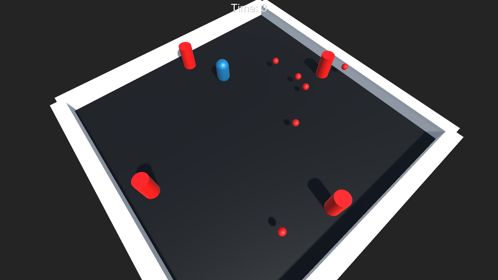
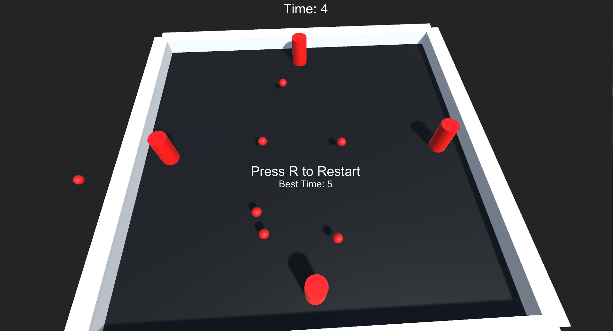

책 "레트로의 유니티 게임 프로그래밍 에센스"을 통한 Unity 공부
> 저자 : 이제민  
> Unity  
> C#

###### 4가지 게임 구현

## 1. 탄막 슈팅 게임 : Dodge  
   
사방에서 무수히 날아오는 탄알을 피하며 가능한 한 오랫동안 버티는 게임

##### 설명/동작/기능
- 벽으로 막혀있고 바닥이 회전하는 공간에서, 사방에 배치된 붉은 기둥이 플레이어를 향해 총알을 발사함
- 게임 중에는 플레이어가 버틴 시간이 UI로 표시되며, 총알에 맞아 플레이어가 죽으면 플레이어의 최고기록이 표시됨
- 게임오버 시 R키를 누르면 게임을 재시작함

##### 조작법
- Moving : 키보드 방향키 / WASD 키
- 게임 재시작 : R키

###### 사용 프로그램
> Unity 2020.3.0f1  
> Visual Studio 2015
 

----------------

##### 배운점 Study
- 태그 Tag
- gameObject, transform 변수
- 프리팹 Prefab
- 트리거 콜라이더
- OnCollision 계열(일반 충돌) vs OnTrigger 계열(트리거 충돌)
- PlayerPrefs 클래스
- 재시작 시 씬이 어두워지는 현상
- (게임 개발에서) 벡터, 오일러각 Euler angle - 짐벌락 Gimbal Lock, 쿼터니언 Quaternion, 좌표계 coordinate system
